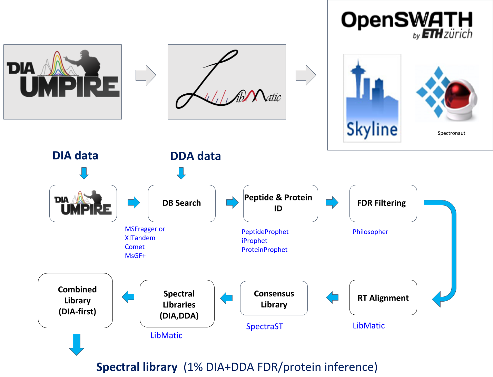

 

# LibMatic
DIA-Umpire based pipeline for generation of spectral libraries for targeted analysis of DIA data.
See [scripts/commands.md](scripts/commands.md) for usage.
## The LibMatic pipeline

 

